# PANDUAN PENGGUNAAN APLIKASI BESAWIT

**Versi dokumen:** 1.0  
**Tanggal penyusunan:** 29 Maret 2026  
**Nama aplikasi:** Besawit  
**Fokus penggunaan:** operasional agen sawit, toko pertanian, persediaan, dan keuangan

---

## Panduan Cepat untuk Training

Halaman ini ditujukan untuk pelatihan singkat bagi pengguna baru yang perlu mulai bekerja tanpa membaca seluruh dokumen lebih dulu.

### Urutan kerja yang disarankan
1. Login ke aplikasi menggunakan akun yang diberikan administrator.
2. Cek **Dashboard** untuk melihat ringkasan operasional hari ini.
3. Pastikan **Master Data** sudah lengkap, terutama petani, pabrik, gudang, supplier, pelanggan toko, dan produk.
4. Jalankan transaksi sesuai kebutuhan:
   - **Pembelian TBS** untuk membeli buah dari petani
   - **Penjualan ke Pabrik** untuk menjual stok TBS dari gudang
   - **Pembelian Barang** untuk stok toko
   - **Penjualan Toko** untuk transaksi toko tunai atau kredit
5. Jika ada pembayaran atau penerimaan, catat dari modul **Finance** atau dari tombol aksi pada detail dokumen.
6. Pantau **Inventory** untuk saldo stok, mutasi, stock take, dan adjustment.
7. Buka **Reports** untuk memeriksa transaksi, margin, hutang, piutang, laba rugi, dan stok.

### Hal yang paling sering gagal saat awal memakai aplikasi
- Login gagal karena email atau password tidak sesuai.
- Penjualan kredit gagal disimpan karena pelanggan atau jatuh tempo belum diisi.
- Penjualan TBS gagal karena gudang asal belum dipilih atau saldo TBS tidak cukup.
- Tombol pembayaran tidak aktif karena dokumen sudah lunas atau user tidak punya hak akses.
- Void transaksi gagal karena stok sudah terpakai atau dokumen sudah memiliki pembayaran.

### Ringkasan modul yang paling sering dipakai
- **Dashboard**: melihat kondisi usaha secara cepat.
- **Palm Agent**: pembelian TBS dan penjualan ke pabrik.
- **Store**: pembelian barang dan penjualan toko.
- **Finance**: hutang, piutang, pembayaran, dan cash ledger.
- **Inventory**: saldo stok, mutasi, stock take, adjustment.

### Fitur yang perlu diketahui sejak awal
- **Lupa password / reset password** belum tersedia di aplikasi.
- **Export PDF dari dalam aplikasi** belum tersedia; yang ada saat ini adalah preview cetak browser pada halaman tertentu.
- **Retur penjualan toko** belum tersedia.
- **Pengaturan sistem umum** belum tersedia sebagai menu terpisah.

---

## 1. Pendahuluan

Besawit adalah aplikasi operasional untuk bisnis agen sawit dan toko pertanian. Aplikasi ini menggabungkan pencatatan transaksi sawit, transaksi toko, stok, hutang, piutang, pembayaran, dan pelaporan dalam satu sistem kerja.

### Tujuan aplikasi
- Mencatat pembelian TBS dari petani secara rapi.
- Mengelola penjualan TBS ke pabrik dari stok gudang.
- Mengelola transaksi toko pertanian.
- Menjaga saldo stok barang dan stok TBS pool.
- Memantau hutang, piutang, pembayaran, dan cash ledger.
- Menyediakan laporan operasional yang cepat dibaca.

### Pengguna aplikasi
- Owner
- Admin operasional sawit
- Admin toko
- Admin finance / kasir
- Supervisor
- Management reviewer

### Manfaat singkat
- Satu sistem untuk transaksi sawit, toko, stok, dan keuangan.
- Status dokumen dan histori pembayaran lebih mudah diaudit.
- Stok TBS pool per gudang dapat dipantau.
- Dokumen penting tertentu dapat dipreview dan dicetak.

---

## 2. Persiapan Sebelum Menggunakan Aplikasi

Sebelum mulai bekerja di Besawit, pastikan hal berikut sudah siap:

### 2.1 Akun pengguna
- Setiap pengguna sebaiknya memakai akun masing-masing.
- Akun dibuat dari modul **Master Data > Pengguna**.
- Peran pengguna diatur dari modul **Master Data > Peran**.

### 2.2 Hak akses
- Menu yang muncul mengikuti role dan hak akses role.
- Tidak semua user bisa melihat seluruh menu.
- Aksi sensitif seperti void, retur, approve, dan pencatatan pembayaran dapat dibatasi per role.

### 2.3 Perangkat dan browser
- Gunakan browser modern seperti Google Chrome atau Microsoft Edge.
- Untuk layar kecil, tabel yang lebar tetap bisa dipakai, tetapi pada beberapa halaman perlu scroll horizontal.

### 2.4 Data master yang perlu disiapkan
Sebelum transaksi dicatat, minimal siapkan:
- Petani
- Pabrik
- Gudang
- Supplier
- Pelanggan toko
- Produk
- Kategori produk
- Kendaraan dan personel armada bila digunakan untuk transaksi TBS

> **Catatan:** Jika pelanggan toko juga merupakan petani, hubungkan pelanggan ke petani agar piutang toko dapat dipotong dari hasil TBS.

---

## 3. Cara Masuk ke Aplikasi

### Langkah login
1. Buka alamat aplikasi Besawit.
2. Masukkan **Email**.
3. Masukkan **Password**.
4. Klik tombol **Login**.
5. Jika berhasil, sistem akan mengarahkan Anda ke **Dashboard**.

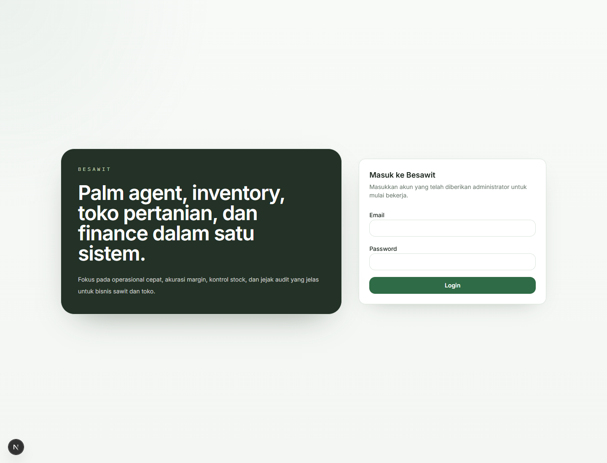
*Gambar 1. Halaman Login.*

### Penjelasan field login
- **Email**: alamat email akun pengguna.
- **Password**: password akun yang diberikan administrator.

### Validasi dasar
- Email wajib diisi dalam format email.
- Password wajib diisi.
- Jika kombinasi email dan password salah, sistem akan menampilkan pesan gagal login.

### Masalah umum saat login
- **Email atau password salah**: pastikan tidak ada salah ketik.
- **Tombol tampak memproses lama**: cek koneksi dan pastikan server/database aplikasi aktif.
- **Akun tidak bisa masuk**: minta admin memeriksa status user dan role.

> **Belum tersedia:** fitur lupa password dan reset password mandiri.

---

## 4. Gambaran Menu Utama

Setelah login, pengguna akan melihat sidebar utama di sisi kiri dan area kerja di sisi kanan.

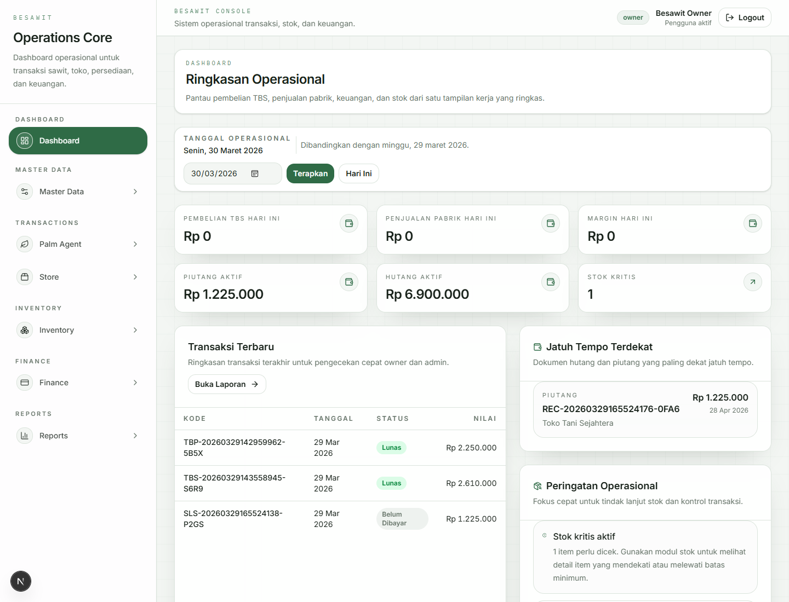
*Gambar 2. Dashboard utama sekaligus contoh struktur sidebar Besawit.*

### Struktur menu utama
- **Dashboard**: ringkasan operasional.
- **Master Data**: data dasar seperti petani, pabrik, pelanggan, supplier, gudang, produk, pengguna, dan peran.
- **Palm Agent**: pembelian TBS dan penjualan ke pabrik.
- **Store**: pembelian barang dan penjualan toko.
- **Inventory**: stok, stock take, adjustment, dan histori mutasi.
- **Finance**: hutang, piutang, pembayaran, dan cash ledger.
- **Reports**: laporan transaksi, margin, hutang, piutang, laba rugi, stok, retur, dan potongan.

### Cara membaca sidebar
- Menu yang terbuka memperlihatkan sub-menu di bawahnya.
- Warna aktif menandakan halaman yang sedang digunakan.
- Jika menu tertentu tidak terlihat, kemungkinan user tidak memiliki hak akses ke menu tersebut.

---

## 5. Dashboard

Dashboard dipakai untuk membaca kondisi usaha secara cepat tanpa membuka modul satu per satu.

### Informasi yang tersedia
- KPI pembelian TBS hari ini
- KPI penjualan pabrik hari ini
- Margin hari ini
- Piutang aktif
- Hutang aktif
- Stok kritis
- Transaksi terbaru
- Jatuh tempo terdekat
- Peringatan operasional
- Widget operasional harian

### Cara menggunakan dashboard
1. Buka menu **Dashboard**.
2. Pilih tanggal operasional bila ingin melihat data hari tertentu.
3. Periksa kartu KPI utama di bagian atas.
4. Lihat **Transaksi Terbaru** untuk memeriksa dokumen terakhir.
5. Lihat **Jatuh Tempo Terdekat** untuk memantau hutang/piutang yang perlu ditindaklanjuti.
6. Gunakan tombol cepat seperti **Buka Laporan**, **Cek Stok**, **Cek Hutang**, atau **Cek Piutang** bila perlu analisis lebih lanjut.

### Catatan penting
- Dashboard menggabungkan ringkasan harian dan snapshot saat ini.
- Dashboard cocok untuk monitoring cepat, tetapi rekonsiliasi akhir tetap sebaiknya dilakukan di modul sumber atau laporan.

### Kesalahan umum
- Menganggap dashboard sebagai satu-satunya sumber audit final.
- Tidak memperhatikan tanggal operasional yang sedang aktif.

---

## 6. Panduan Master Data

Master data adalah fondasi seluruh transaksi. Isi data master terlebih dahulu sebelum transaksi dimulai.

### 6.1 Daftar modul master yang tersedia
- Petani
- Pabrik
- Pelanggan Toko
- Supplier
- Personel Armada
- Kendaraan
- Gudang
- Produk
- Kategori
- Pengguna
- Peran

### 6.2 Pola umum penggunaan master data
1. Buka menu **Master Data**.
2. Pilih modul yang diinginkan.
3. Gunakan kolom pencarian untuk mencari dokumen.
4. Klik **Tambah** untuk membuat data baru.
5. Isi form sesuai kebutuhan.
6. Simpan data.
7. Buka detail bila ingin memeriksa isi data atau histori terkait.

### 6.3 Pelanggan Toko
Modul ini penting karena pelanggan toko bisa dihubungkan ke petani.

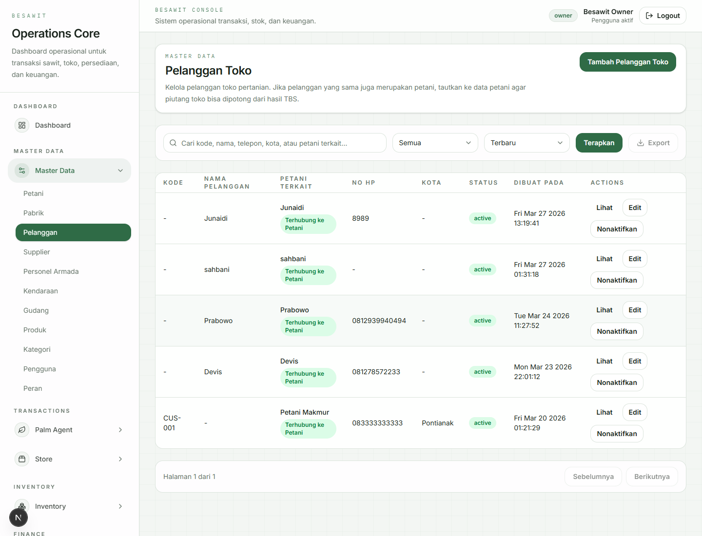
*Gambar 3. Daftar pelanggan toko pada modul Master Data.*

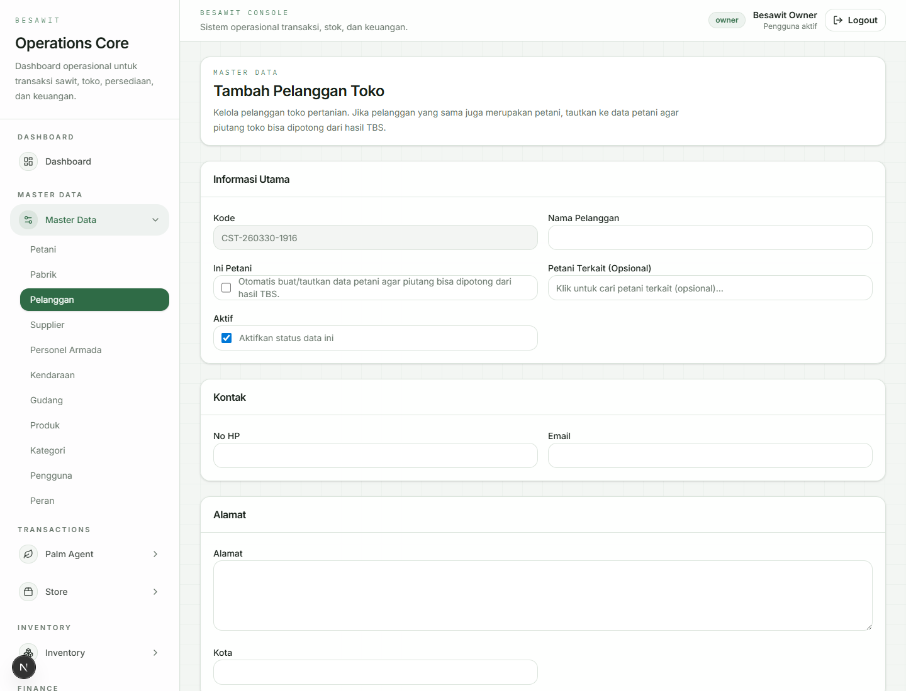
*Gambar 4. Form tambah pelanggan toko dengan pilihan petani terkait.*

**Tujuan**
- Mencatat pelanggan toko pertanian.
- Menghubungkan pelanggan ke petani jika orang yang sama bertransaksi di toko dan sawit.

**Langkah tambah pelanggan toko**
1. Buka **Master Data > Pelanggan**.
2. Klik **Tambah Pelanggan Toko**.
3. Isi **Kode** dan **Nama Pelanggan**.
4. Jika pelanggan juga petani, aktifkan **Ini Petani**.
5. Klik field **Petani Terkait (Opsional)**, lalu cari nama petani yang sesuai.
6. Isi kontak dan alamat bila ada.
7. Pastikan status **Aktif** sesuai kebutuhan.
8. Klik **Simpan**.

**Catatan penting**
- Jika pelanggan dihubungkan ke petani, nama pelanggan akan mengikuti nama petani.
- Satu petani tidak boleh ditautkan ke lebih dari satu pelanggan toko.

**Kesalahan umum**
- Membuat pelanggan baru padahal petaninya sudah ada.
- Tidak menautkan pelanggan ke petani, sehingga piutang toko tidak dapat dipotong dari hasil TBS secara benar.

### 6.4 Produk dan kategori
Gunakan modul **Produk** untuk mengelola:
- kode produk
- nama produk
- satuan
- harga beli
- harga jual
- stok minimum

Gunakan modul **Kategori** untuk mengelompokkan produk.

> **Catatan:** produk sistem **TBS Pool** digunakan untuk stok TBS campuran per gudang dan bukan produk toko biasa.

### 6.5 Pengguna dan peran
Gunakan modul **Pengguna** dan **Peran** untuk:
- membuat akun user
- mengatur role
- memilih hak akses halaman dan aksi sensitif

> **Catatan penting:** Password wajib diisi saat membuat user baru. Fitur reset password mandiri belum tersedia.

---

## 7. Panduan Transaksi Utama

## 7.1 Pembelian TBS

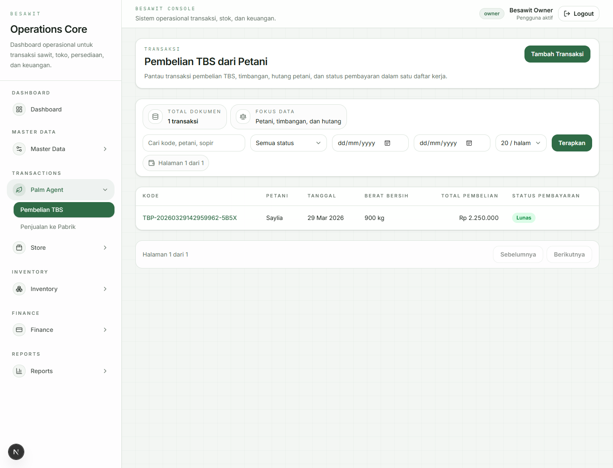
*Gambar 5. Daftar transaksi pembelian TBS.*

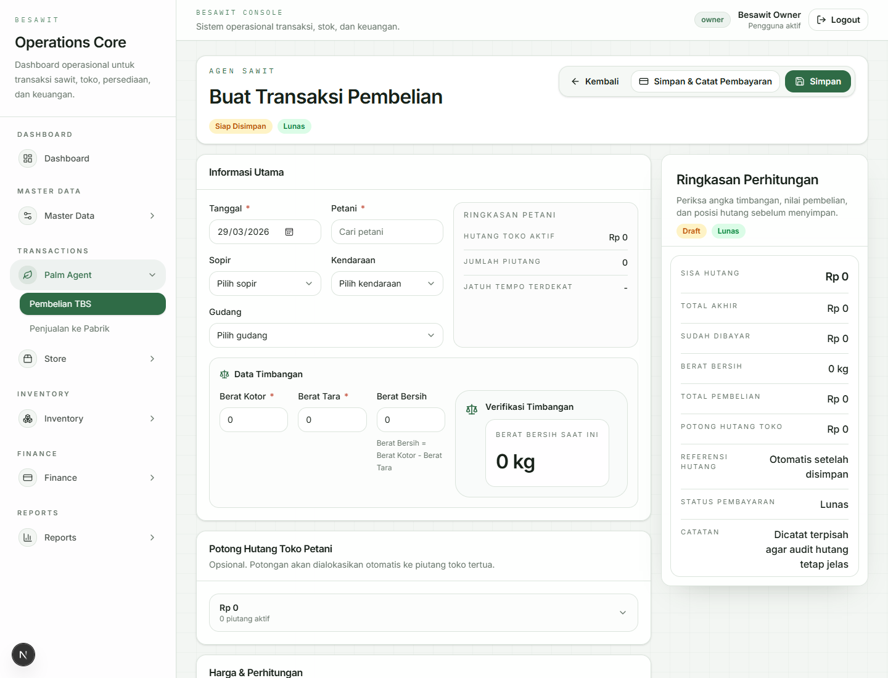
*Gambar 6. Form pembelian TBS dari petani.*

**Tujuan**  
Mencatat pembelian buah dari petani dan membentuk stok TBS pool di gudang.

**Kapan digunakan**  
Saat perusahaan membeli TBS dari petani.

**Langkah penggunaan**
1. Buka **Palm Agent > Pembelian TBS**.
2. Klik **Tambah Transaksi**.
3. Isi **Tanggal**.
4. Pilih **Petani**.
5. Pilih **Sopir**, **Kendaraan**, dan **Gudang** bila tersedia.
6. Isi bagian **Data Timbangan**:
   - Berat Kotor
   - Berat Tara
   - Berat Bersih akan dihitung sistem
7. Isi harga dan biaya pada bagian berikutnya.
8. Jika perlu, isi **Potong Hutang Toko Petani**.
9. Periksa panel **Ringkasan Perhitungan** di sisi kanan.
10. Klik **Simpan** atau **Simpan & Catat Pembayaran**.

**Field penting**
- **Petani**: wajib.
- **Gudang**: wajib, karena stok TBS akan masuk ke gudang ini.
- **Berat Kotor / Berat Tara**: dasar perhitungan berat bersih.
- **Harga Beli / Kg**: dasar nilai pembelian.

**Tombol/Aksi penting**
- **Simpan**
- **Simpan & Catat Pembayaran**
- **Preview Slip Timbang** pada halaman detail
- **Cetak** pada halaman detail
- **Void Pembelian** pada halaman detail jika syarat terpenuhi

**Validasi yang perlu diperhatikan**
- Petani wajib dipilih.
- Gudang wajib dipilih.
- Berat tara tidak boleh melebihi berat kotor.
- Jika ada potong hutang toko, relasi petani dan pelanggan toko harus benar.

**Kesalahan umum**
- Salah memilih gudang.
- Menginput timbangan sebelum memastikan angka final.
- Menganggap transaksi bisa diedit bebas setelah stok terbentuk.

**Tips penggunaan**
- Gunakan **Simpan & Catat Pembayaran** jika langsung melakukan pelunasan ke petani.
- Cek panel ringkasan sebelum simpan agar nilai hutang sesuai.

## 7.2 Penjualan ke Pabrik

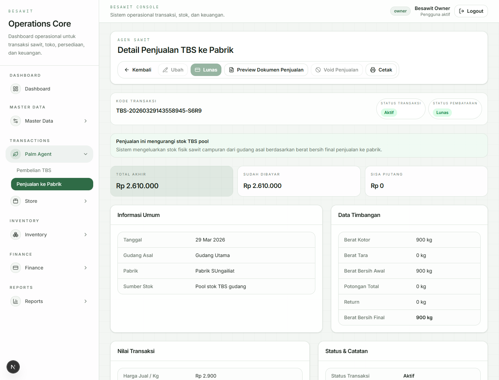
*Gambar 8. Halaman detail penjualan TBS ke pabrik.*

**Tujuan**  
Mencatat penjualan TBS dari stok gudang ke pabrik dan membentuk piutang.

**Kapan digunakan**  
Saat TBS dari gudang dikirim ke pabrik.

**Langkah penggunaan**
1. Buka **Palm Agent > Penjualan ke Pabrik**.
2. Klik **Tambah Transaksi**.
3. Isi **Tanggal**.
4. Pilih **Gudang Asal**.
5. Pastikan saldo TBS gudang cukup.
6. Pilih **Pabrik**.
7. Isi timbangan penjualan.
8. Isi harga jual.
9. Isi potongan, grading, atau return bila ada.
10. Isi **Jatuh Tempo Piutang**.
11. Periksa ringkasan perhitungan.
12. Klik **Simpan**.

**Field penting**
- **Gudang Asal**: wajib.
- **Pabrik**: wajib.
- **Jatuh Tempo Piutang**: penting untuk transaksi piutang.
- **Berat Bersih Final**: menentukan total penjualan dan pengurangan stok.

**Validasi yang perlu diperhatikan**
- Penjualan harus mengambil stok dari gudang yang dipilih.
- Saldo TBS gudang harus cukup.
- Jatuh tempo harus diisi bila piutang digunakan.

**Kesalahan umum**
- Memilih gudang yang salah.
- Menginput potongan/grading tanpa verifikasi dokumen pabrik.
- Tidak memeriksa dampak return terhadap netto final.

**Tips penggunaan**
- Setelah simpan, buka detail transaksi untuk mengecek breakdown potongan dan piutang.
- Gunakan preview dokumen penjualan sebelum mencetak.

## 7.3 Pembelian Barang Toko

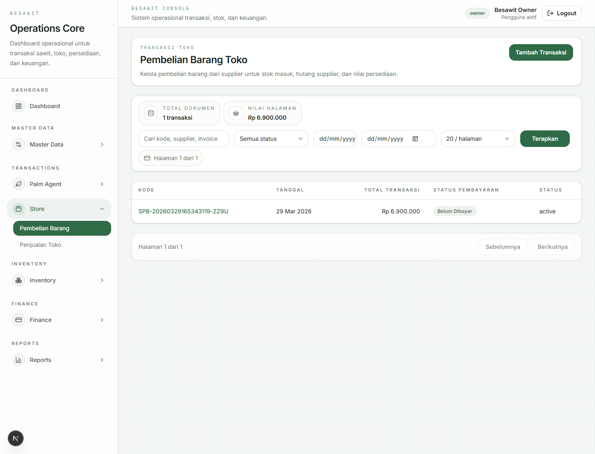
*Gambar 9. Daftar pembelian barang toko.*

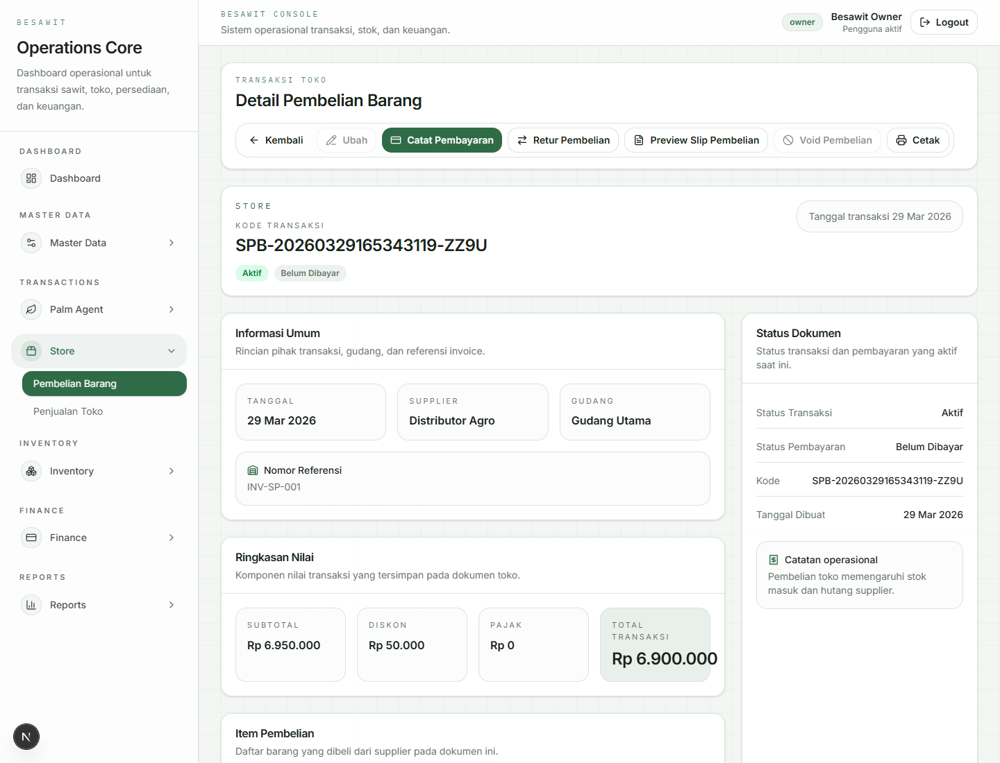
*Gambar 10. Detail pembelian barang toko beserta item dan retur.*

**Tujuan**  
Mencatat pembelian barang dari supplier untuk menambah stok toko dan membentuk hutang supplier.

**Langkah penggunaan**
1. Buka **Store > Pembelian Barang**.
2. Klik **Tambah Transaksi**.
3. Pilih **Supplier** dan **Gudang**.
4. Isi tanggal dan nomor invoice supplier jika ada.
5. Tambahkan item barang.
6. Isi qty dan harga beli masing-masing item.
7. Periksa subtotal, diskon, pajak, dan total.
8. Klik **Simpan**.

**Tombol/Aksi penting pada detail**
- **Catat Pembayaran**
- **Preview Slip Pembelian**
- **Retur Pembelian**
- **Void Pembelian**
- **Cetak**

**Kesalahan umum**
- Salah gudang tujuan stok.
- Menginput invoice yang tidak sesuai dokumen supplier.
- Melakukan retur setelah pembayaran sudah berjalan.

**Catatan penting**
- Retur pembelian saat ini hanya didukung sebelum ada pembayaran supplier.

## 7.4 Penjualan Toko

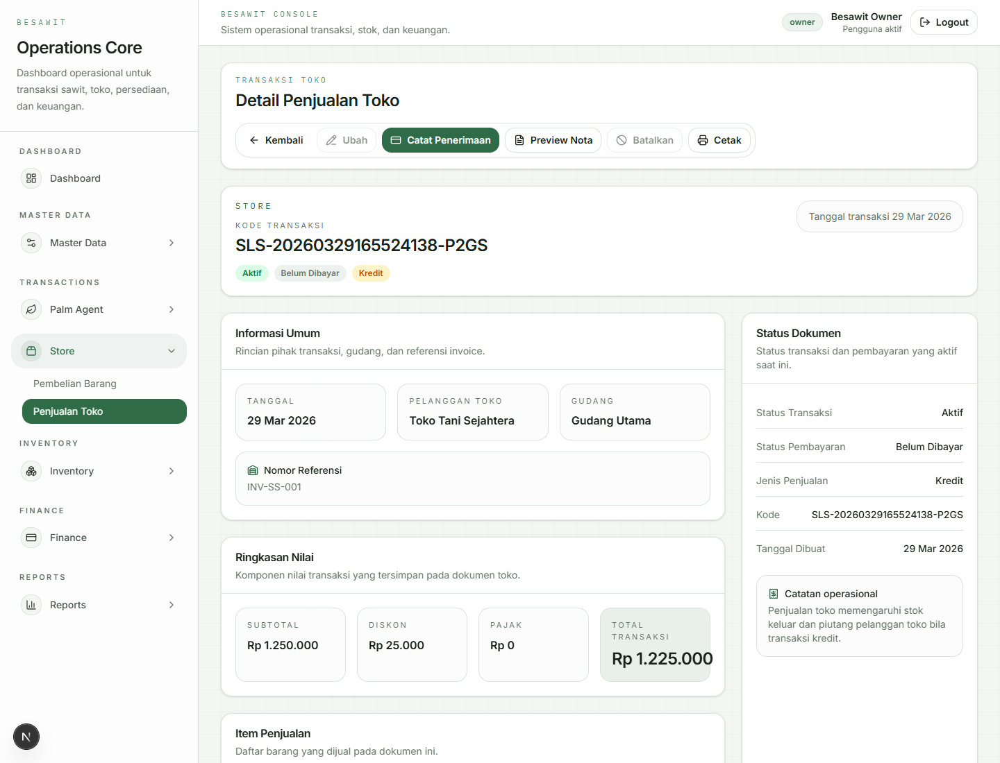
*Gambar 11. Detail penjualan toko.*

**Tujuan**  
Mencatat penjualan barang toko secara tunai atau kredit.

**Langkah penggunaan**
1. Buka **Store > Penjualan Toko**.
2. Klik **Tambah Transaksi**.
3. Pilih **Gudang**.
4. Pilih **Pelanggan** bila transaksi kredit.
5. Tambahkan item dan qty.
6. Pilih jenis penjualan:
   - **Tunai**
   - **Kredit**
7. Jika kredit, isi **Jatuh Tempo Piutang**.
8. Klik **Simpan**.

**Field penting**
- **Jenis Penjualan**
- **Pelanggan** untuk kredit
- **Jatuh Tempo Piutang** untuk kredit
- **Qty item** dan **harga jual**

**Validasi**
- Penjualan kredit wajib memiliki pelanggan.
- Penjualan kredit wajib memiliki jatuh tempo.
- Stok barang harus cukup.

**Kesalahan umum**
- Memilih kredit tetapi tidak memilih pelanggan.
- Lupa mengisi jatuh tempo.

**Catatan penting**
- **Retur penjualan toko belum tersedia.**

## 7.5 Pembayaran / Penerimaan

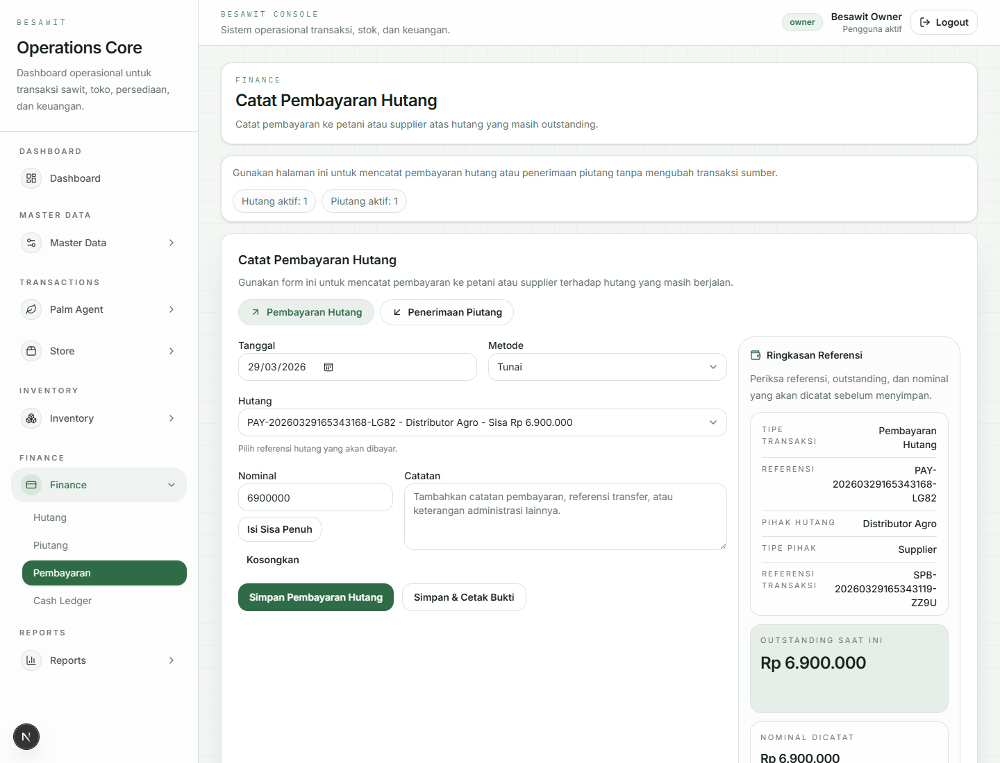
*Gambar 12. Form pembayaran atau penerimaan pada modul Finance.*

**Tujuan**  
Mencatat pembayaran hutang atau penerimaan piutang.

**Langkah penggunaan**
1. Buka dari tombol aksi pada detail hutang/piutang atau transaksi terkait.
2. Pastikan referensi hutang/piutang sudah terisi.
3. Isi **Tanggal Pembayaran**.
4. Pilih **Arah Transaksi** bila diperlukan.
5. Pilih **Metode** pembayaran.
6. Isi **Nominal**.
7. Tambahkan catatan jika perlu.
8. Klik **Simpan**.

**Catatan penting**
- Pencatatan payment dipisahkan dari transaksi utama agar audit lebih rapi.
- Setelah payment diposting, status hutang/piutang akan menyesuaikan.

## 7.6 Hutang dan Piutang

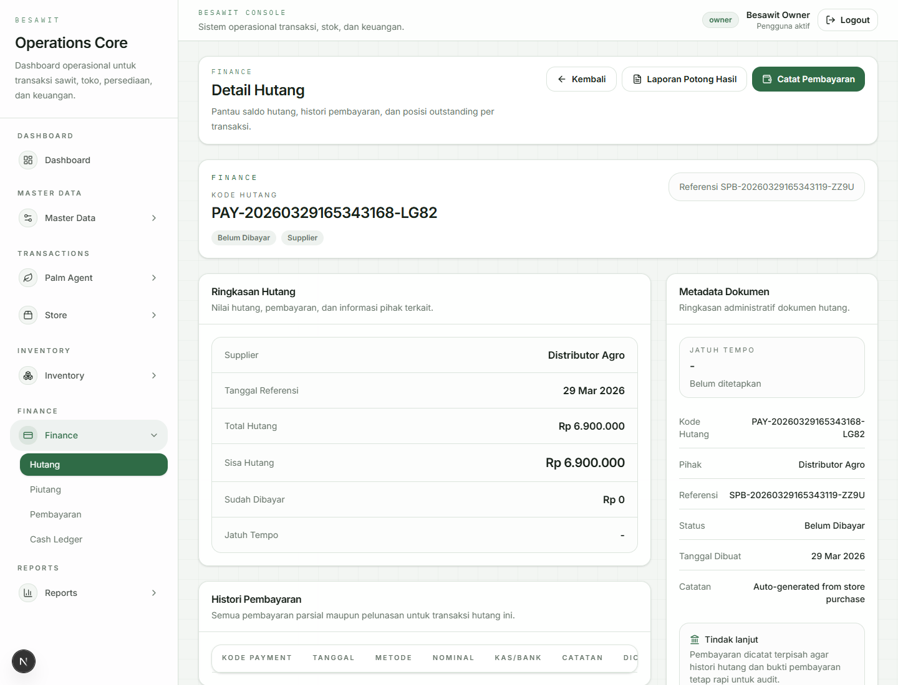
*Gambar 13. Detail hutang pada modul Finance.*

**Tujuan**  
Memantau dokumen hutang dan piutang, termasuk jatuh tempo dan histori pembayaran.

**Langkah memeriksa hutang/piutang**
1. Buka menu **Finance > Hutang** atau **Finance > Piutang**.
2. Gunakan pencarian, filter status, dan filter jenis pihak.
3. Klik kode dokumen untuk membuka detail.
4. Periksa:
   - total
   - outstanding
   - due date
   - histori pembayaran/penerimaan
5. Gunakan tombol **Catat Pembayaran** atau **Catat Penerimaan** bila diperlukan.

**Kesalahan umum**
- Membayar dokumen yang sebenarnya sudah lunas.
- Tidak memeriksa due date saat menindaklanjuti outstanding.

## 7.7 Inventory / Mutasi Stok

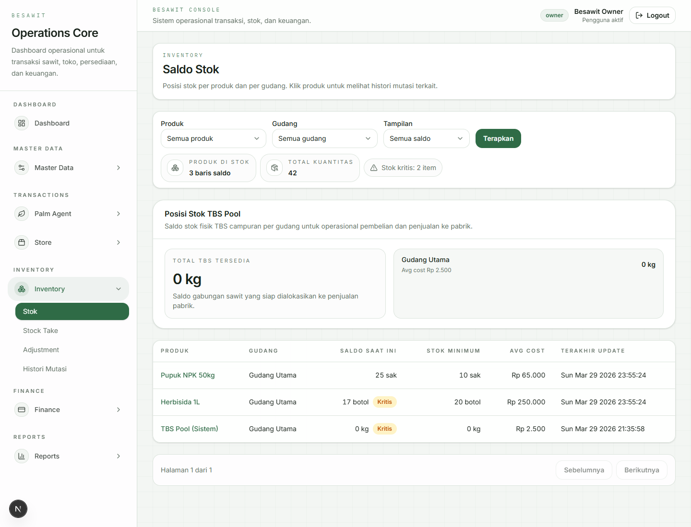
*Gambar 14. Halaman saldo stok dan posisi TBS pool.*

**Tujuan**  
Memantau stok barang dan stok TBS pool per gudang.

**Langkah penggunaan**
1. Buka **Inventory > Stok**.
2. Gunakan filter produk, gudang, dan tampilan stok kritis.
3. Periksa bagian **Posisi Stok TBS Pool** untuk saldo TBS campuran per gudang.
4. Klik produk untuk membuka histori mutasi.

**Catatan penting**
- `TBS Pool (Sistem)` adalah produk internal untuk saldo TBS campuran.
- Histori mutasi TBS tersedia dari modul histori mutasi.

---

## 8. Panduan Detail Transaksi

Bagian ini menjelaskan informasi apa saja yang biasanya muncul pada halaman detail dokumen.

## 8.1 Detail Pembelian TBS

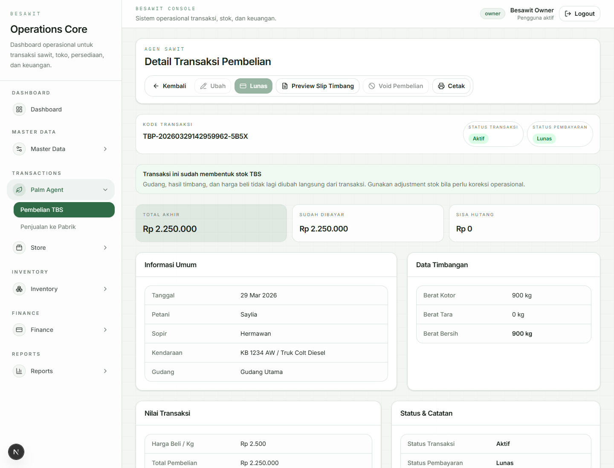
*Gambar 7. Halaman detail pembelian TBS.*

### Informasi yang ditampilkan
- Header dokumen dan kode transaksi
- Status transaksi
- Status pembayaran
- Ringkasan nominal:
  - total akhir
  - sudah dibayar
  - sisa hutang
- Informasi umum:
  - tanggal
  - petani
  - sopir
  - kendaraan
  - gudang
- Data timbangan
- Nilai transaksi
- Breakdown potong hutang toko bila ada
- Histori pembayaran petani
- Audit log

### Tombol tindakan yang tersedia
- **Kembali**
- **Ubah** (dibatasi jika stok sudah terbentuk)
- **Catat Pembayaran**
- **Preview Slip Timbang**
- **Void Pembelian**
- **Cetak**

### Peringatan
- Void pembelian dapat diblok jika stok sudah terpakai atau sudah ada pembayaran.

## 8.2 Detail Penjualan TBS ke Pabrik

Pada detail penjualan pabrik, pengguna dapat memeriksa:
- gudang asal
- pabrik
- timbangan awal dan final
- deduction dan return
- total penjualan
- margin
- sisa piutang
- breakdown potongan
- audit log

Tombol yang tersedia:
- **Kembali**
- **Catat Penerimaan**
- **Preview Dokumen Penjualan**
- **Void Penjualan**

## 8.3 Detail Pembelian Barang

Halaman ini menampilkan:
- kode transaksi
- supplier
- gudang
- status pembayaran
- ringkasan nilai
- tabel item pembelian
- ringkasan retur
- catatan

Tombol yang tersedia:
- **Catat Pembayaran**
- **Preview Slip Pembelian**
- **Retur Pembelian**
- **Void Pembelian**
- **Cetak**

## 8.4 Detail Penjualan Toko

Halaman ini menampilkan:
- kode transaksi
- pelanggan
- gudang
- jenis penjualan
- status pembayaran
- tabel item penjualan
- catatan

Tombol yang tersedia:
- **Catat Penerimaan**
- **Preview Nota**
- **Cetak**

---

## 9. Panduan Laporan dan Monitoring

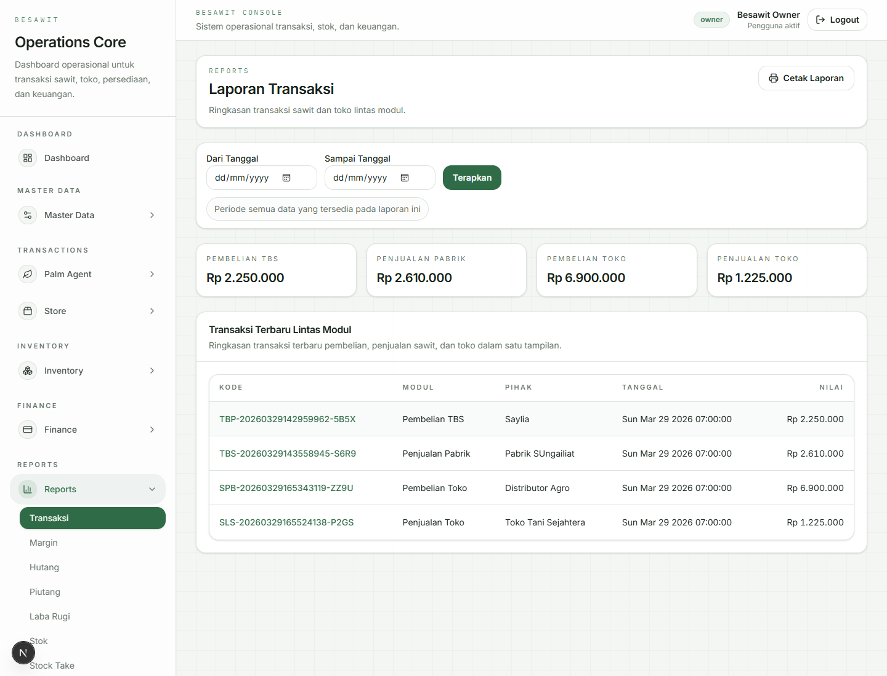
*Gambar 15. Halaman laporan transaksi lintas modul.*

### Laporan yang tersedia
- Laporan Transaksi
- Laporan Margin
- Laporan Hutang
- Laporan Piutang
- Laporan Laba Rugi
- Laporan Stok
- Laporan Stock Take
- Laporan Retur
- Laporan Potongan

### Cara menggunakan laporan
1. Buka menu **Reports**.
2. Pilih jenis laporan.
3. Isi filter periode bila tersedia.
4. Klik **Terapkan**.
5. Periksa kartu ringkasan dan tabel detail.
6. Gunakan **Cetak Laporan** bila ingin mencetak tampilan saat ini.

### Cara membaca laporan
- Kartu atas berisi ringkasan utama.
- Tabel di bawah berisi detail atau snapshot dokumen.
- Perhatikan apakah laporan bersifat ringkasan periode atau snapshot dokumen terbaru.

### Catatan penting
- Saat ini laporan mendukung **cetak browser**.
- **Export PDF dari dalam aplikasi belum tersedia.**

---

## 10. Hak Akses dan Pengaturan

### Hak akses yang tersedia
- Hak akses menu dan halaman diatur dari modul **Peran**.
- User dihubungkan ke role dari modul **Pengguna**.
- Aksi sensitif tertentu juga dapat dibatasi, seperti:
  - catat pembayaran/penerimaan
  - void transaksi tertentu
  - retur pembelian
  - approve stock take
  - approve adjustment

### Pengaturan sistem
- **Belum tersedia sebagai modul terpisah.**
- Saat ini belum ada menu pengaturan umum untuk parameter sistem.

### Catatan untuk administrator
- Setelah mengubah role atau hak akses, minta pengguna login ulang.

---

## 11. Troubleshooting

### Tidak bisa login
- Periksa email dan password.
- Pastikan akun aktif.
- Pastikan server dan database aktif.
- Jika tetap gagal, minta admin memeriksa user dari modul **Pengguna**.

### Data tidak muncul
- Periksa filter pencarian dan status.
- Pastikan Anda punya hak akses ke modul tersebut.

### Tombol tidak aktif
- Dokumen bisa jadi sudah lunas, sudah dibatalkan, atau user tidak punya hak akses.
- Void juga bisa diblok jika stok atau pembayaran tidak memungkinkan.

### Transaksi tidak bisa disimpan
- Periksa field wajib.
- Untuk penjualan kredit, pastikan pelanggan dan jatuh tempo terisi.
- Untuk penjualan TBS, pastikan gudang asal dan saldo stok benar.

### Status tidak berubah
- Pembayaran dan penerimaan harus dicatat melalui modul payment, bukan hanya dengan mengedit transaksi.

### Print tidak muncul
- Pastikan Anda membuka halaman preview dokumen yang benar.
- Tidak semua modul memiliki format cetak khusus.

### Laporan kosong
- Periksa periode filter.
- Pastikan memang sudah ada data transaksi pada periode tersebut.

### Hak akses tidak sesuai
- Periksa role user.
- Minta admin memeriksa checklist hak akses pada modul **Peran**.

---

## 12. Batasan Sistem Saat Ini

Berikut batasan aplikasi berdasarkan implementasi saat ini:

- Fitur **lupa password / reset password** belum tersedia.
- **Export PDF dari dalam aplikasi** belum tersedia.
- **Retur penjualan toko** belum tersedia.
- **Pengaturan sistem umum** belum tersedia sebagai menu tersendiri.
- **Audit log terpusat** belum tersedia sebagai halaman khusus lintas modul.
- Beberapa tabel pada layar kecil masih bergantung pada scroll horizontal.
- Void transaksi yang berdampak ke stok tetap harus dipakai dengan hati-hati oleh user yang berwenang.

---

## 13. SOP Penggunaan Singkat

Untuk penggunaan harian yang lebih aman, terapkan SOP berikut:

1. Lengkapi data master sebelum mulai transaksi.
2. Pastikan gudang dipilih dengan benar pada transaksi yang memengaruhi stok.
3. Periksa timbangan dan nilai sebelum klik simpan.
4. Hindari membuat data master ganda.
5. Catat pembayaran dan penerimaan dari modul Finance atau detail dokumen terkait.
6. Review hutang, piutang, dan stok secara berkala.
7. Lakukan stock take dan adjustment sesuai kebutuhan audit.
8. Gunakan void hanya oleh user yang memahami dampaknya terhadap stok dan keuangan.

---

## 14. Ringkasan Cepat untuk Training

### Langkah masuk
1. Buka halaman login.
2. Masukkan email dan password.
3. Klik **Login**.

### Modul yang paling sering dipakai
- Dashboard
- Pembelian TBS
- Penjualan ke Pabrik
- Pembelian Barang
- Penjualan Toko
- Hutang / Piutang
- Inventory

### Alur kerja singkat
1. Siapkan master data.
2. Jalankan transaksi.
3. Catat pembayaran/penerimaan.
4. Pantau stok dan laporan.

### Hal yang harus dihindari
- Salah gudang.
- Salah pelanggan/petani terkait.
- Menyimpan transaksi kredit tanpa jatuh tempo.
- Menganggap semua dokumen bisa di-void kapan saja.

---

## Lampiran Gambar Penting

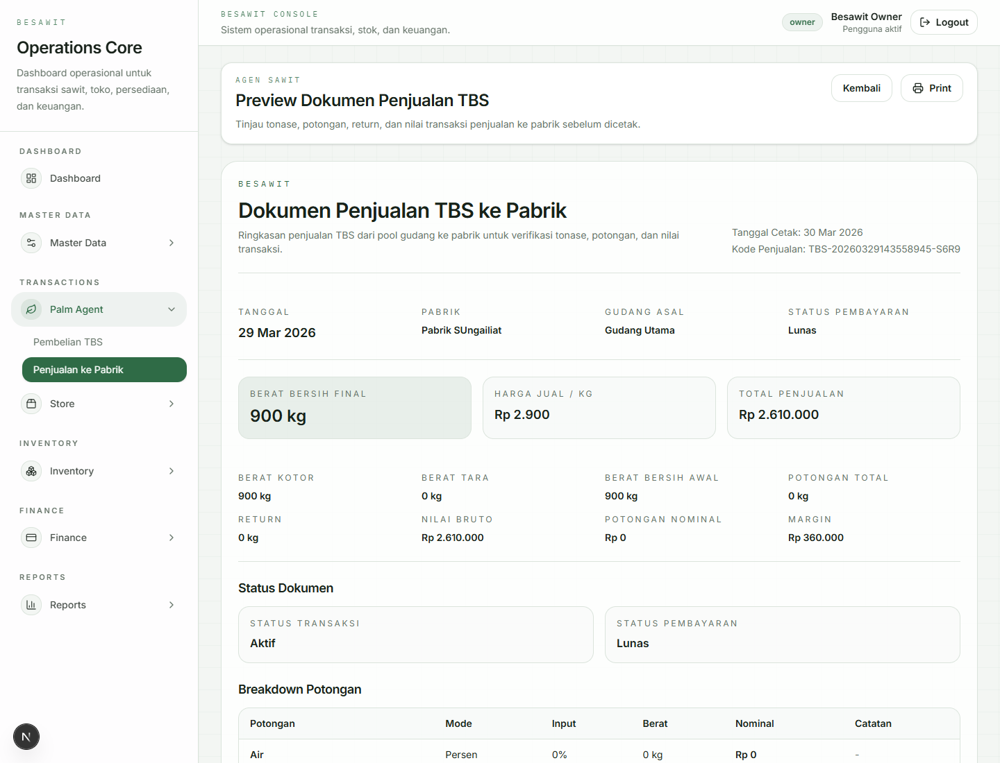
*Gambar 16. Preview dokumen penjualan TBS ke pabrik.*

Dokumen preview seperti ini dapat dipakai untuk pengecekan sebelum cetak atau arsip operasional.
